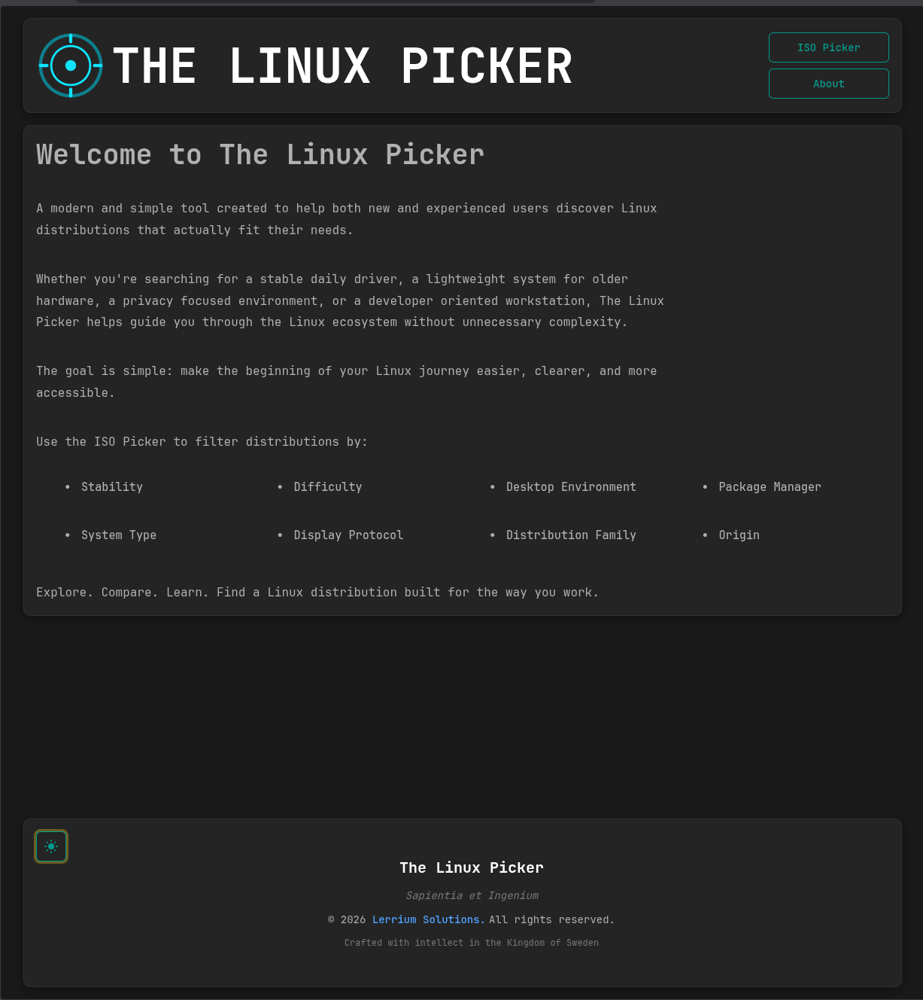
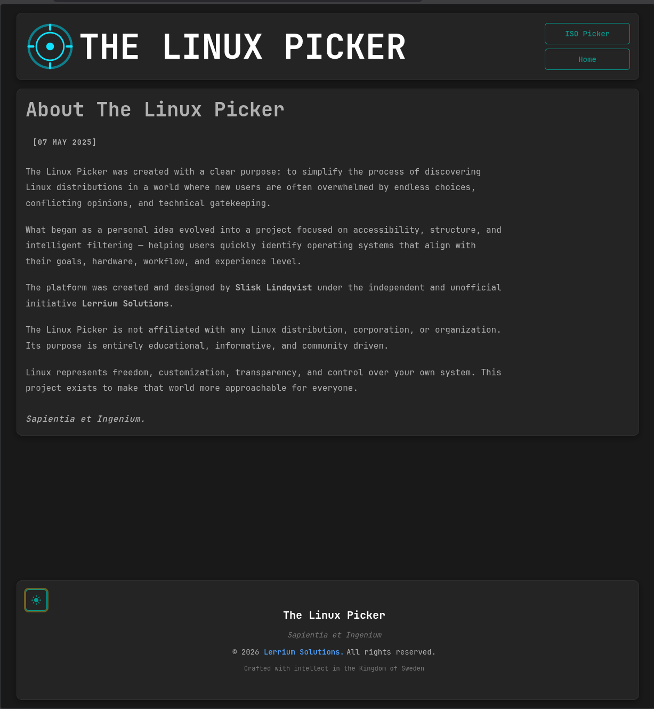
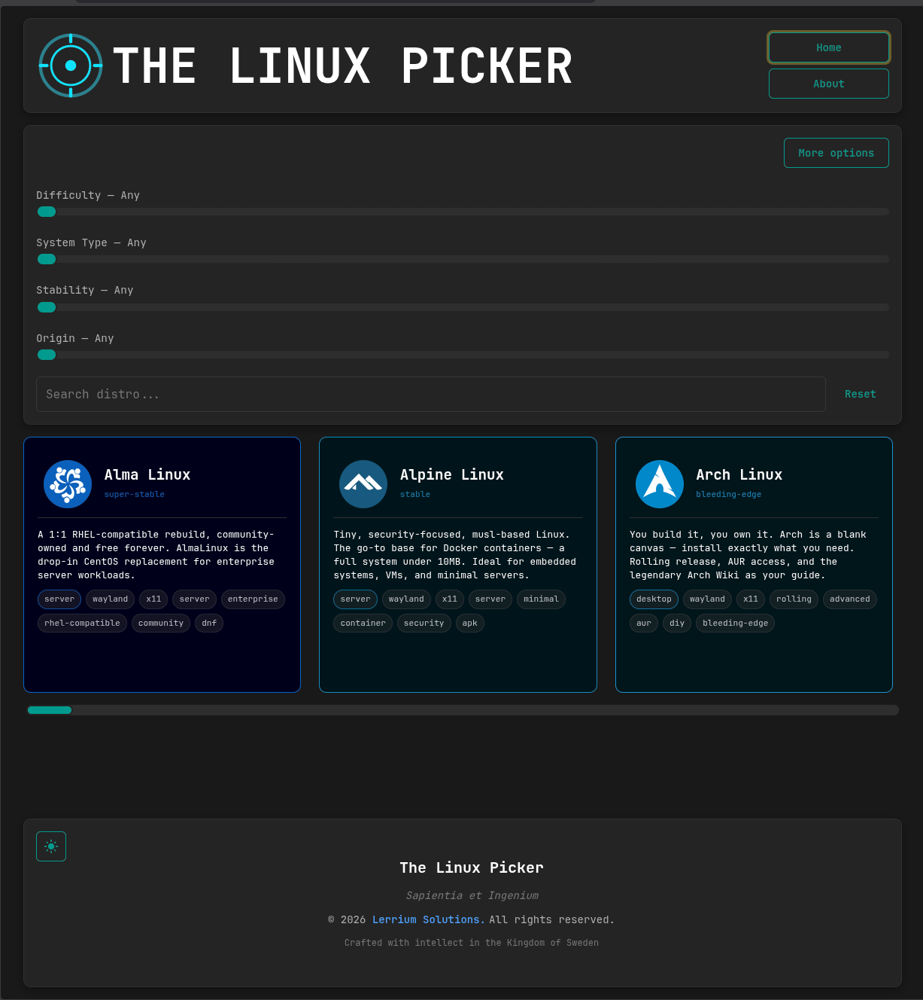
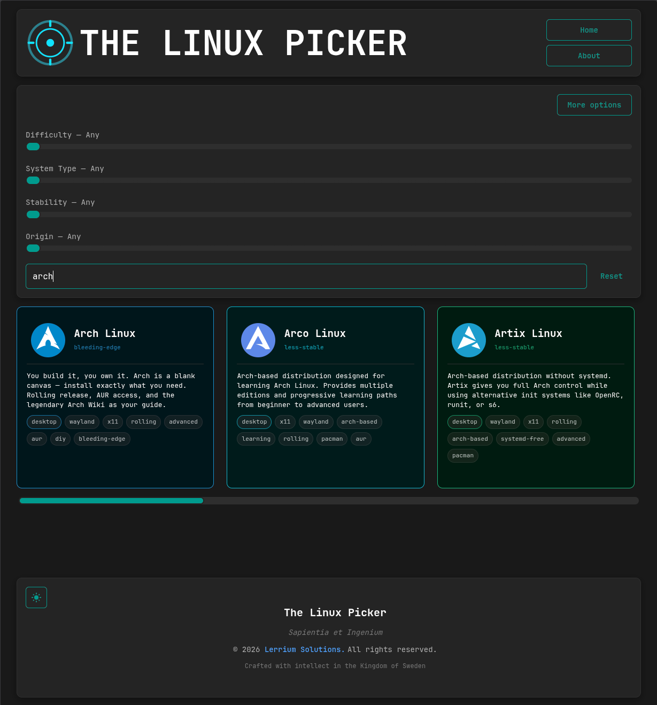
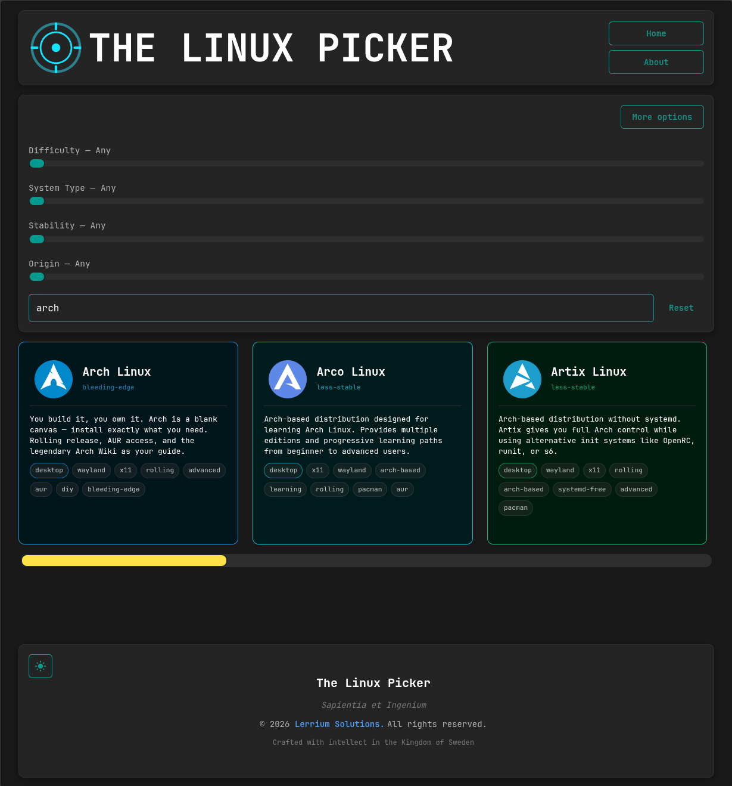
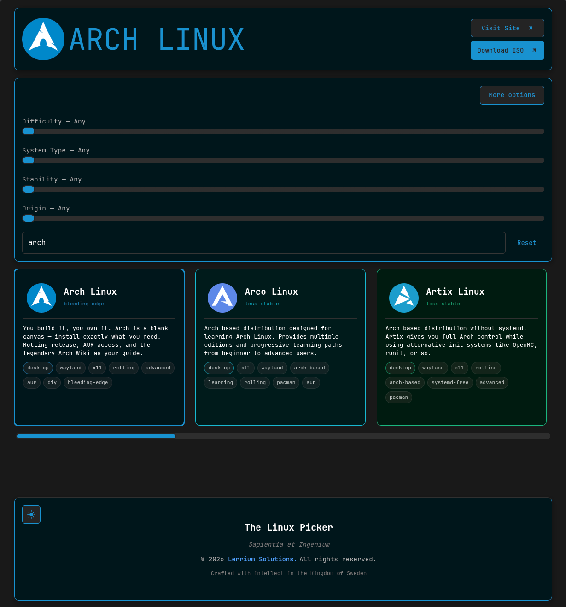
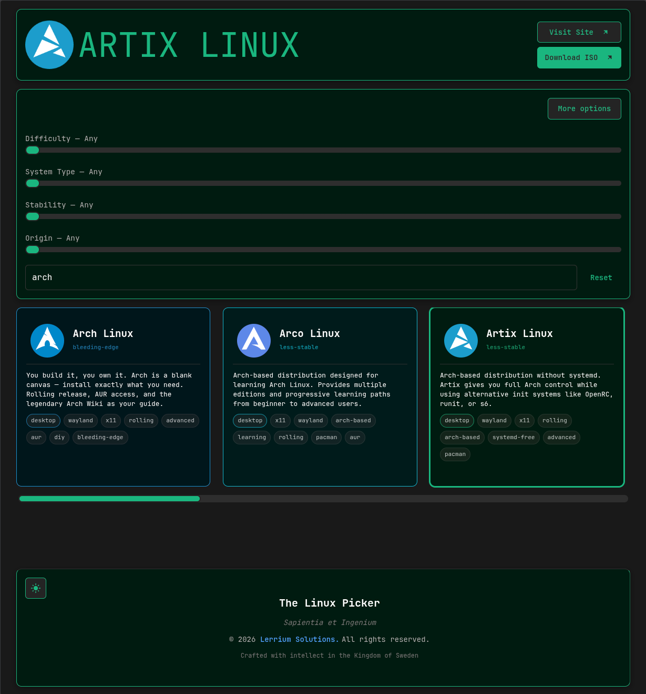
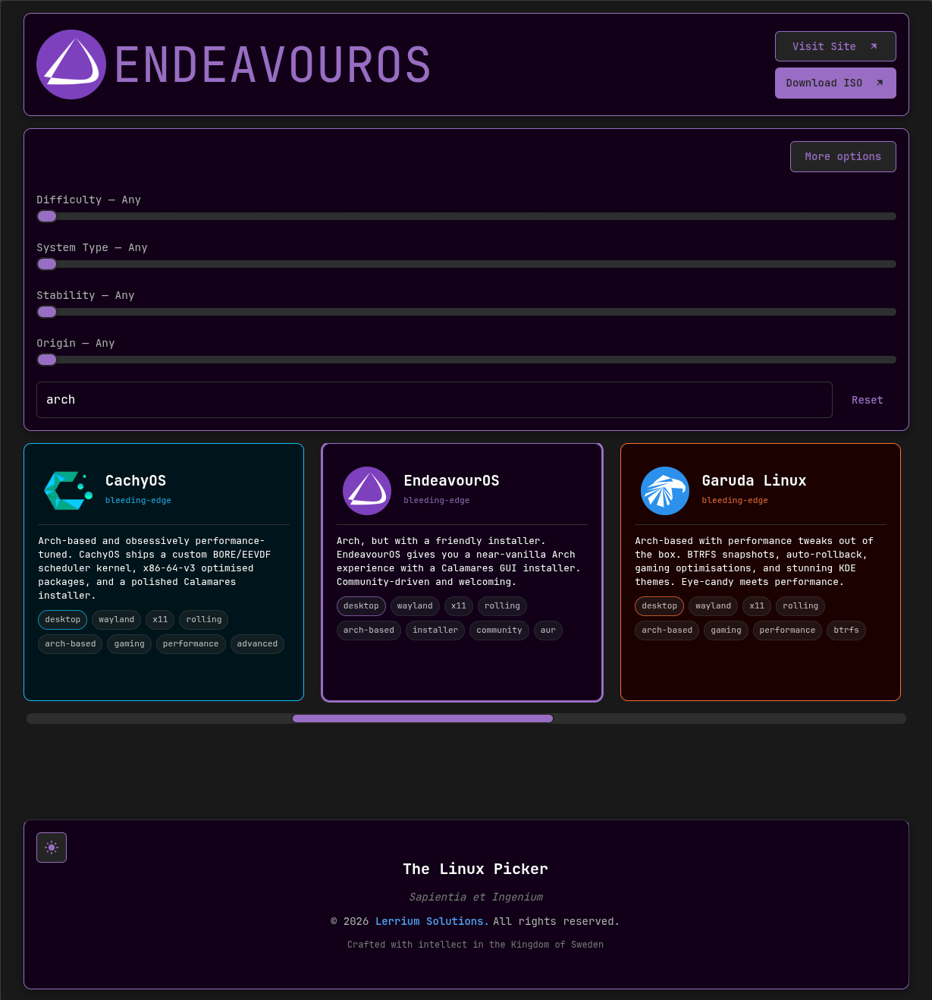
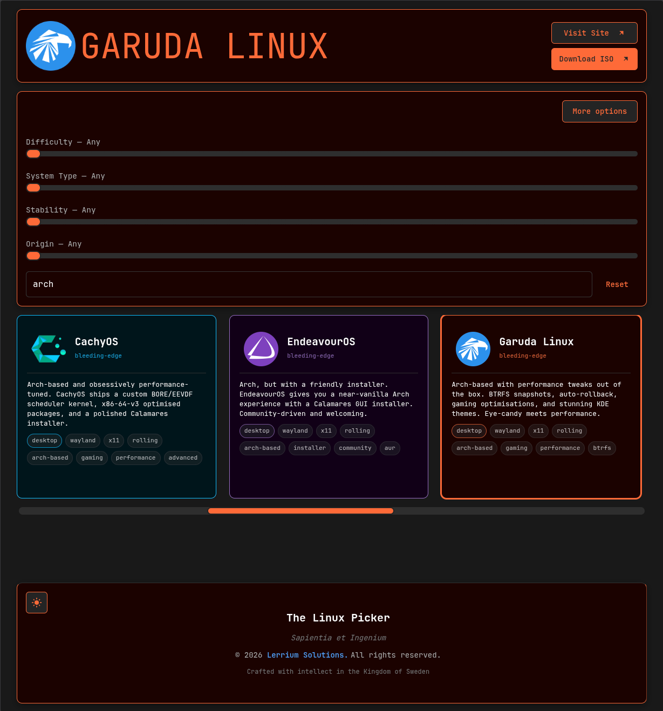
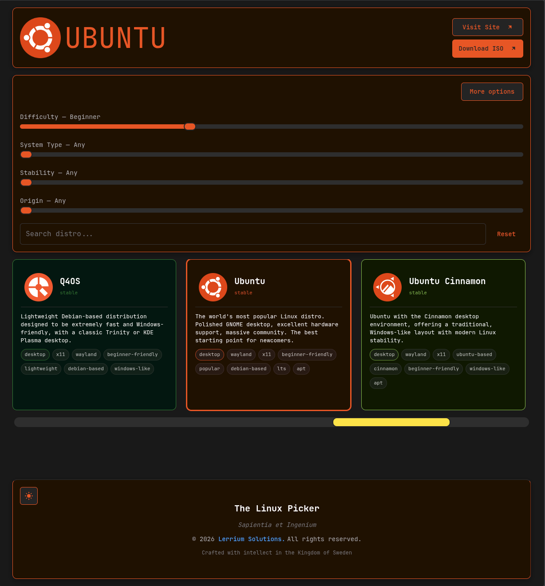

# The Linux Picker

A modern and intelligent Linux distribution discovery platform built to help both new and experienced users find Linux distributions that actually fit their needs.

The Linux ecosystem is powerful, diverse, and endlessly customizable — but that freedom often comes with overwhelming complexity.  
The Linux Picker was created to simplify that experience through structured filtering, clean presentation, and accessible guidance.

Whether you're searching for:

- a stable daily driver
- a lightweight system for older hardware
- a developer focused workstation
- a privacy oriented environment
- a gaming optimized setup
- or a beginner friendly first Linux experience

The Linux Picker helps guide users through the Linux landscape without unnecessary noise or gatekeeping.

---

## Philosophy

The project is built around a simple goal:

> Make the beginning of the Linux journey easier, clearer, and more accessible.

Linux represents:
- freedom
- transparency
- customization
- ownership over your own system

This project exists to make that world more approachable for everyone.

---

## Features

### Distribution Filtering

Users can filter Linux distributions by:

- **Difficulty** — scored 1–10 with human-readable translations (Beginner Friendly → Expert)
- **Stability** — scored 1–10 with human-readable translations (Bleeding Edge → Rock Solid)
- **System Type** — Desktop, Server, Gaming, Minimal, Workstation
- **Origin** — Official or Community
- **GPU** — AMD, Intel, or NVIDIA out-of-box driver support
- **Display Protocol** — Wayland or X11
- **Desktop Environment** — filtered to only show environments valid for the selected protocol
- **Primary Package Manager** — APT, DNF, Pacman, Portage, Nix, Zypper, XBPS, APK, eopkg
- **Also Supports** — Flatpak, Snap, AppImage, AUR
- **Release Model** — Rolling, LTS, Fixed, Immutable, Semi-Rolling
- **Init System** — systemd, OpenRC, runit, s6, dinit
- **Distribution Family** — Independent, Debian, Ubuntu, Arch, RedHat, SUSE
- **Desktop Richness** — Minimal through Full Desktop
- **Max RAM Requirement** — filter by how little RAM the distro needs
- **Architecture** — x86_64, ARM64, ARMhf, i386, PPC64, MIPS

---

### Distribution Data

Each distribution includes:

- **Difficulty Score** — a 1–10 composite rating across installer complexity, hardware support, breakage risk, documentation quality, community size, and configuration required
- **Stability Score** — a 1–10 rating reflecting how stable the release model and package pipeline is
- **Gradient bars** — visual green-to-red difficulty and red-to-green stability indicators with human-readable translations
- **System Requirements** — minimum and recommended RAM, storage, supported architectures, BIOS/UEFI support
- **Package Management** — primary package manager, secondary formats (Snap, Flatpak), AUR availability, repo size
- **Out-of-box highlights** — codecs, GPU drivers, gaming tools, office tools, dual-boot friendliness
- **Links** — home page, download page, latest ISO, wiki, news, forums, source code, RSS feed, and social channels sorted by relevance
- **Per-distro theming** — each card and the expanded header adopt the distro's own brand colors in both dark and light mode

---

### Modern UI

- Responsive layout — mobile, tablet, and desktop
- Dark / Light mode
- Card based interface with per-distro theming
- Fast client-side filtering
- Expandable Links card with primary links and social icons
- Clean Linux inspired aesthetic

---

### Project Goals

The Linux Picker focuses on:

- accessibility
- usability
- discoverability
- educational value
- modern frontend architecture

---

## Built With

- React
- Vite
- JavaScript
- CSS
- Material UI Icons

---

## Screenshots

### Dark Theme

| Screenshot | Preview |
|---|---|
| 001 |  |
| 002 |  |
| 003 |  |
| 004 |  |
| 005 |  |
| 006 |  |
| 007 |  |
| 008 |  |
| 009 |  |
| 010 |  |

---

## Installation

Clone the repository:

```bash
git clone https://github.com/LinuxPicker/linuxpicker.github.io.git
```

Navigate into the project:

```bash
cd linux-picker.website
```

Install dependencies:

```bash
npm install
```

Start the development server:

```bash
npm run dev
```

---

## Build

Create a production build:

```bash
npm run build
```

Preview the production build:

```bash
npm run preview
```

---

## Project Status

The Linux Picker is currently under active development.

New features, UI improvements, filtering systems, additional distributions, and platform refinements are continuously being worked on.

---

## Author

Created and designed by **Slisk Lindqvist**  
Under the independent and unofficial initiative **Lerrium Solutions**

---

## Disclaimer

The Linux Picker is not affiliated with any Linux distribution, organization, or corporation.

All trademarks, logos, and distribution names belong to their respective owners.

---

## License

This project is licensed under the MIT License.

---

## Motto

> Sapientia et Ingenium
